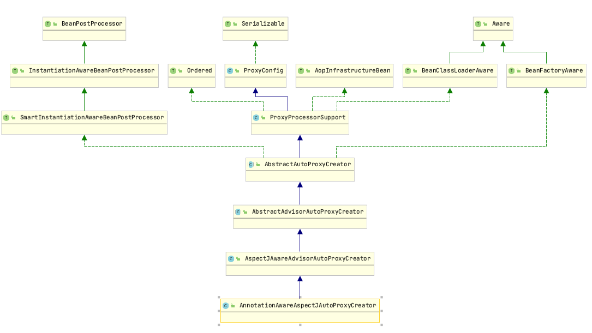

# AOP
An aspect’s functionality (advice) is woven into a program’s execution at one or more join points

Instance targetObject and return Proxy

Get targetObject and invoke


## 1. AOP Expression

### Advice

- describing the job that an aspect will perform
- advice addresses the question of when to perform
- type: Before, After, After-returning, After-throwing, Around

### Join Points

- A join point is a point in the execution of the application where an aspect can be plugged in

### Pointcuts

- Expression for join points

### Annotation	

- indicate **@EnableAspectJAutoProxy** in Configuration
- indicate **@Aspect** in aspect bean

```xml
<beans xmlns="http://www.springframework.org/schema/beans"
	   xmlns:xsi="http://www.w3.org/2001/XMLSchema-instance"
	   xmlns:context="http://www.springframework.org/schema/context" 
	   xmlns:aop="http://www.springframework.org/schema/aop"      
	   xsi:schemaLocation="http://www.springframework.org/schema/beans
		   http://www.springframework.org/schema/beans/spring-beans-3.0.xsd
		   http://www.springframework.org/schema/context http://www.springframework.org/schema/context/spring-context-3.0.xsd
		   http://www.springframework.org/schema/aop http://www.springframework.org/schema/aop/spring-aop-3.0.xsd">
		<aop:aspectj-autoproxy/> 
		<!--Declare the AOP Bean-->
		<bean id="myInterceptor" class="aop.MyInterceptor"/>
        <aop:config>
            <aop:aspect id="asp" ref="aspectbean">
                <aop:pointcut id="mycut" expression="execution(* service.impl.PersonServiceBean.*(..))"/>
                <aop:before pointcut-ref="mycut"  method="doAccessCheck"/>
                <aop:after-returning pointcut-ref="mycut" method="doAfterReturn"/>
                <aop:after pointcut-ref="mycut" method="doAfter"/>
                <aop:after-throwing pointcut-ref="mycut" method="doAfterThrowing"/>
                <aop:around pointcut-ref="mycut" method="doProfiling"/>
            </aop:aspect>
        </aop:config>
</beans>
```
```java

@EnableAspectJAutoProxy
public class ApplicationConfig {

    @Bean
    public TxtAdvice txtAdvice() {
        return new TxtAdvice();
    }
}
@Aspect
public class MyInterceptor {
	
	/* Expression 
	Pointcut("execution(returnValue package.[child package].class.method(arguments))")
	*/
	@Pointcut("execution(* service.impl.PersonServiceBean.*(..))")
	private void anyMethod() {}
	
	@Before("anyMethod()")
	public void doAccessCheck() { System.out.println("before info");}
	
	@Before("anyMethod() && args(userName)") 
	public void doAccessCheck(String userName) {}

	@AfterReturning(pointcut = "anyMethod()", returning="result")
	public void doAfterReturn(String result) {}

	@After("anyMethod()")
	public void doAfter() {}

	@AfterThrowing(pointcut="anyMethod()", throwing="e")	
	public void doAfterThrowing(Exception e){}

	@Around("anyMethod()")	
	public Object doProfiling(ProceedingJoinPoint pjp) throws Throwable {
		Object result = pjp.proceed();
		return result;
	}
}
```
### AOP Expression
Result | Expression
---|---
return type is String | "execution(java.lang.String service.impl.PersonServiceBean.*(..))"
first argument is String | "execution(java.lang.String service.impl.PersonServiceBean.*(java.lang.String..))"
return type is not void | "execution(!void service.impl.PersonServiceBean.*(..))"
all the class under package | "execution(* service..*.*(..))"


## 2. 源码解析

### 2.1 导入切面组件

**@EnableAspectJAutoProxy**

+ @Import(AspectJAutoProxyRegistrar.class)

+ AspectJAutoProxyRegistrar 注册了 AnnotationAwareAspectJAutoProxyCreator Bean, 名字是 internalAutoProxyCreator


### 2.2 类结构

AnnotationAwareAspectJAutoProxyCreator 结构




+ AbstractAutoProxyCreator
     + setBeanFactory
     + postProcessBeforeInstantiation
     + postProcessAfterInstantiation
+ AbstractAdvisorAutoProxyCreator
     + override setBeanFactory 
     + call initBeanFactory
+ AnnotationAwareAspectJAutoProxyCreator
     + initBeanFactory

- Creation Sequence
    + create AnnotationConfigApplicationContext
    + refresh() to call registerBeanPostProcessors()
        + get list context's BeanPostProcessor definition
        + contains internalAutoProxyCreator which is AnnotationAwareAspectJAutoProxyCreator
        + register BeanPostProcessor which implements PriorityOrdered
        + register BeanPostProcessor which implements Ordered
            + try to get internalAutoProxyCreator but it's null first time
            + create singleton instance of AnnotationAwareAspectJAutoProxyCreator for internalAutoProxyCreator
            + populatebBean() perform depenedency injection
            + initializeBean()
                + invokeAwareMethods() to execute setBeanFactory for BeanFactoryAware
                    + AnnotationAwareAspectJAutoProxyCreator execute initBeanFactory
                        + ReflectiveAspectJAdvisorFactory
                        + AspectJAdvisorBuilder
                + applyBeanPostProcessorBeforeInitialization()
                + invokeInitMethods()
                + applyBeanPostProcessorAfterInitialization
        + register regular BeanPostProcessor
    + add BeanPostProcessor to BeanFactory
    + AnnotationConfigApplicationContext
        + finishBeanFactoryInitialization
            + loop all the create and get bean via getBean(), doGetBean(), getSinglteon() 
            + createBean()
                + check if bean exist from cache, get bean directly if exist
                + if bean does not exist, create bean and put into cache
                    + resolveBeforeInstantiation: expect beanPostProcessor to return proxy
                        + applyBeanPostProcessBeforeInstantiation
                            if BeanPostProcessor is InstantiationAwareBeanPostProcessor, execute postProcessBeforeInstantiation()
                        + applyBeanPostProcessAfterInstantiation
                    + if no proxy, execute doCreate()
    + AnnotationAwareAspectJAutoProxyCreator
        + execute postProcessBeforeInstantiation()
            + verify if bean in advisedBean
            + verify is bean belong to Advice, Pointcut, @Aspect
            + verify is skip
                + get all the aspect's advice method, advice method is InstantiationModelAwarePointcutAdvisor
                + should skip always return false, means never skip
        + execute postProcessAfterInstantiation()
            + AbstractAutoProxyCreator execute wrapIfNecessary()
            + get all the InstantiationModelAwarePointcutAdvisor for current bean
            + filter all applicable advisor and sort the advisor and wrapped into Object[]
            + create proxy via createProxy(bean.getClass(), beanName, specificInterceptors, new SingletonTargetSource(bean))
                + get all advisor
                + save into ProxyFactory
                + ProxyFactory create JDKDynamicAopProxy or ObjenesisCglibAopProxy(bean is implments interface)
            + return Proxy Object to context
- Execution Sequence
    + context contains proxy, proxy bean contains advisor and target class
    + CglibAopProxy intercept()
        + if no interceptor chain, direct method.invoke()
        + if has interceptor chain, chain execution till target object
            + get target class interceptor chain via this.advised.getInterceptorsAndDynamicInterceptionAdvice(method, targetClass);
            + create methodInvocation new CglibMethodInvocation(proxy, target, method, args, targetClass, chain, methodProxy)
                + create list to store interceptor chain, e.g. List<Object> interceptorList = new ArrayList<>(advisors.length);
                + loop all InstantiationModelAwarePointcutAdvisor and wrap to MethodInterceptor
            + CglibMethodInvocation.proceed()
                + if no interceptor, execute method.invoke(target, methodname)
                + start index as = -1
                    + increase index and then get interceptor in sequence
                    + execute Interceptor.invoke(this), this = CglibMethodInvocation
                    + set the MethodInvocation to threadLocal
                    + execute CglibMethodInvocation.proceed() will loop same method again
        + Chain Sequence
            + AspectJAfterThrowingAdvice
                + CglibMethodInvocation.proceed()
                + invokeAdviceMethod() in catch block if there is exception 
            + AspectReturningAdviceInterceptor
                + CglibMethodInvocation.proceed()
                + advice.afterReturning() if there is no exception
            + AspectJAfterAdvice
                + CglibMethodInvocation.proceed()
                + invokeAdviceMethod() in finally block, no catch block
            + MethodBeforeAdviceInterceptor
                + execute beforeAdvice
                + CglibMethodInvocation.proceed()
    
- Notes:
    + BeanPostProcessor：proccesor handle the bean after bean has been instance
    + InstantiationAwareBeanPostProcessor: processor handle the bean before bean creation
    + AnnotationAwareAspectJAutoProxyCreator intercept before all bean creation


## 3. 事务声明

### Transaction configuration

+ @EnableTransactionManagement in configuration
+ configure dataSource bean
+ configure transactionManager(datasource)

### Service加入事务

```java
@Configuration
@ComponentScan("com.bp.spring.aop.tx")
@EnableTransactionManagement
public class TxConfig {

    @Bean
    public PlatformTransactionManager transactionManager() throws Exception{
        return new DataSourceTransactionManager(dataSource());
    }

    @Bean
    public DataSource dataSource() throws Exception{
        ComboPooledDataSource dataSource = new ComboPooledDataSource();
        dataSource.setUser("root");
        dataSource.setPassword("password");
        dataSource.setDriverClass("com.mysql.jdbc.Driver");
        dataSource.setJdbcUrl("jdbc:mysql://localhost:3306/test");
        return dataSource;
    }

    @Bean
    public JdbcTemplate jdbcTemplate() throws Exception{
        JdbcTemplate jdbcTemplate = new JdbcTemplate(dataSource());
        return jdbcTemplate;
    }
}

@Service
public class UserService {

    @Autowired
    private UserDao userDao;

    @Transactional
    public void insertUser(){
        userDao.insert();
    }
}
```
### 源码实现

**@EnableTransactionManagement import TransactionManagementConfigurationSelector**

**TransactionManagementConfigurationSelector import AutoProxyRegistrar and ProxyTransactionManagementConfiguration**

+ **AutoProxyRegistrar**: register InfrastructureAdvisorAutoProxyCreator bean definition
    + InfrastructureAdvisorAutoProxyCreator wraped the target class to Proxy bean
+ **ProxyTransactionManagementConfiguration**: 
    + register transactionAdvisor
    + transactionAdvisor get the annotation metadata based on AnnotationTransactionAttributeSource
    + transactionAdvisor wrapped transactionInterceptor, transactionInterceptor is MethodInterceptor
    + transactionInterceptor
        + get transaction properties
        + get transaction manager, if qualifer is not declared, will get transaction manager based on class type

```java
public abstract class TransactionAspectSupport implements BeanFactoryAware, InitializingBean {
    @Nullable
	protected Object invokeWithinTransaction(Method method, @Nullable Class<?> targetClass, final InvocationCallback invocation) throws Throwable {

        TransactionInfo txInfo = createTransactionIfNecessary(ptm, txAttr, joinpointIdentification);
        Object retVal;
        try {
            retVal = invocation.proceedWithInvocation();
        } catch (Throwable ex) {
            completeTransactionAfterThrowing(txInfo, ex);
            throw ex;
        } finally {
            cleanupTransactionInfo(txInfo);
        }
    }
}
```
