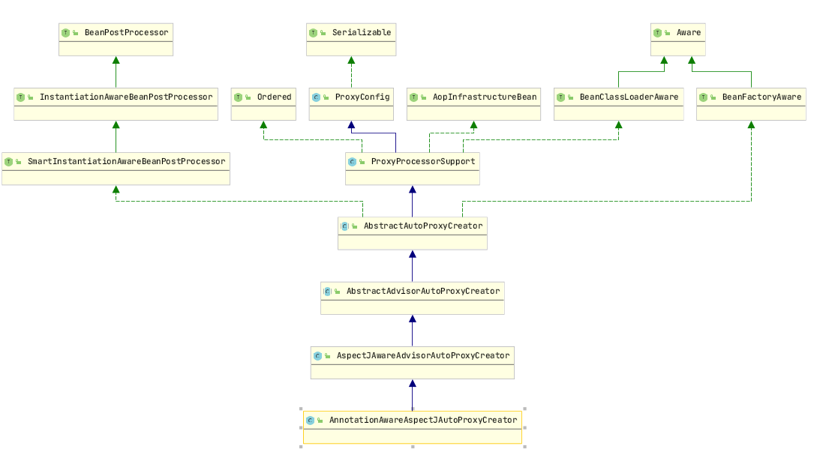

# 扩展原理
An aspect’s functionality (advice) is woven into a program’s execution at one or more join points

Instance targetObject and return Proxy

Get targetObject and invoke


## 1. AOP Expression

### Advice

- describing the job that an aspect will perform
- advice addresses the question of when to perform
- type: Before, After, After-returning, After-throwing, Around

### Join Points

- A join point is a point in the execution of the application where an aspect can be plugged in

### Pointcuts

- Expression for join points

### Annotation	

- indicate **@EnableAspectJAutoProxy** in Configuration
- indicate **@Aspect** in aspect bean

```java
@EnableAspectJAutoProxy
public class ApplicationConfig {

    @Bean
    public TxtAdvice txtAdvice() {
        return new TxtAdvice();
    }
}
@Aspect
public class MyInterceptor {
	
	/* Expression 
	Pointcut("execution(returnValue package.[child package].class.method(arguments))")
	*/
	@Pointcut("execution(* service.impl.PersonServiceBean.*(..))")
	private void anyMethod() {}
	
	@Before("anyMethod()")
	public void doAccessCheck() { System.out.println("before info");}
	
	@Before("anyMethod() && args(userName)") 
	public void doAccessCheck(String userName) {}

	@AfterReturning(pointcut = "anyMethod()", returning="result")
	public void doAfterReturn(String result) {}

	@After("anyMethod()")
	public void doAfter() {}

	@AfterThrowing(pointcut="anyMethod()", throwing="e")	
	public void doAfterThrowing(Exception e){}

	@Around("anyMethod()")	
	public Object doProfiling(ProceedingJoinPoint pjp) throws Throwable {
		Object result = pjp.proceed();
		return result;
	}
}
```
### AOP Expression
Result | Expression
---|---
return type is String | "execution(java.lang.String service.impl.PersonServiceBean.*(..))"
first argument is String | "execution(java.lang.String service.impl.PersonServiceBean.*(java.lang.String..))"
return type is not void | "execution(!void service.impl.PersonServiceBean.*(..))"
all the class under package | "execution(* service..*.*(..))"


## 2. 源码解析

### 2.1 导入切面组件定义

**@EnableAspectJAutoProxy**

+ @Import(AspectJAutoProxyRegistrar.class)

+ AspectJAutoProxyRegistrar 注册了 AnnotationAwareAspectJAutoProxyCreator Bean, 名字是 internalAutoProxyCreator


### 2.2 AutoProxyCreator类结构

AnnotationAwareAspectJAutoProxyCreator 结构




**AnnotationAwareAspectJAutoProxyCreator实现InstantiationAwareBeanPostProcessor接口**

+ postProcessBeforeInstantiation: 在bean对象创建之前
+ postProcessAfterInstantiation：在bean对象创建之后


**AbstractAutoProxyCreator和AbstractAdvisorAutoProxyCreator 实现BeanFactoryAware接口**

+ BeanFactoryAware让Bean获取到Spring的BeanFactory工厂

+ AbstractAutoProxyCreator.setBeanFactory()
+ AbstractAdvisorAutoProxyCreator.initBeanFactory()


### 2.3 创建AutoProxyCreator

#### 宏观流程

传入配置类，创建ioc容器

注册配置类，调用refresh（）刷新容器；

**registerBeanPostProcessors(beanFactory)注册bean的后置处理器来方便拦截bean的创建**

+ 先获取ioc容器已经定义了的需要创建对象的所有BeanPostProcessor

+ 优先注册实现了PriorityOrdered接口的BeanPostProcessor；

+ **再给容器中注册实现了Ordered接口的BeanPostProcessor；**

+ 注册没实现优先级接口的BeanPostProcessor

+ 注册BeanPostProcessor，实际上就是创建BeanPostProcessor对象，保存在容器中

把BeanPostProcessor注册到BeanFactory中；


#### 微观流程 - 注册实现了Ordered接口的BeanPostProcessor

**创建internalAutoProxyCreator的BeanPostProcessor【AnnotationAwareAspectJAutoProxyCreator】**

创建Bean的实例

populateBean；给bean的各种属性赋值

initializeBean：初始化bean；

+ invokeAwareMethods()：处理Aware接口的方法回调
+ applyBeanPostProcessorsBeforeInitialization()：应用后置处理器的postProcessBeforeInitialization（）
+ invokeInitMethods()；执行自定义的初始化方法
+ applyBeanPostProcessorsAfterInitialization()；执行后置处理器的postProcessAfterInitialization（）；

+ BeanPostProcessor(AnnotationAwareAspectJAutoProxyCreator)创建成功


### 2.4 调用AutoProxyCreator创建代理对象

#### 宏观流程

**finishBeanFactoryInitialization(beanFactory)完成BeanFactory初始化工作并创建剩下的单实例bean**

遍历获取容器中所有的Bean

依次通过getBean(beanName)创建对象

+ 先从缓存中获取当前bean，如果能获取到，说明bean是之前被创建过的，直接使用，否则再创建；

+ 只要创建好的Bean都会被缓存起来
  + **InstantiationAwareBeanPostProcessor是在创建Bean实例之前先尝试用后置处理器返回对象**
  + resolveBeforeInstantiation(beanName, mbdToUse)去创建一个代理对象
    + InstantiationAwareBeanPostProcessor调用applyBeanPostProcessorsBeforeInstantiation获取advisor
    + InstantiationAwareBeanPostProcessor调用applyBeanPostProcessorsAfterInitialization创建代理对象

+ doCreateBean(beanName, mbdToUse, args)真正的去创建一个bean实例

```JAVA
public abstract class AbstractAutowireCapableBeanFactory {
		protected Object createBean(String beanName, RootBeanDefinition mbd, @Nullable Object[] args)
			try {
			// Give BeanPostProcessors a chance to return a proxy instead of the target bean instance.
                Object bean = resolveBeforeInstantiation(beanName, mbdToUse);
                if (bean != null) {
                    return bean;
                }
            }
            catch (Throwable ex) {
                throw new BeanCreationException(mbdToUse.getResourceDescription(), beanName,
                        "BeanPostProcessor before instantiation of bean failed", ex);
            }
		}

	@Nullable
	protected Object resolveBeforeInstantiation(String beanName, RootBeanDefinition mbd) {
		Object bean = null;
		if (!Boolean.FALSE.equals(mbd.beforeInstantiationResolved)) {
			// Make sure bean class is actually resolved at this point.
			if (!mbd.isSynthetic() && hasInstantiationAwareBeanPostProcessors()) {
				Class<?> targetType = determineTargetType(beanName, mbd);
				if (targetType != null) {
					bean = applyBeanPostProcessorsBeforeInstantiation(targetType, beanName);
					if (bean != null) {
						bean = applyBeanPostProcessorsAfterInitialization(bean, beanName);
					}
				}
			}
			mbd.beforeInstantiationResolved = (bean != null);
		}
		return bean;
	}
}
```


#### 微观流程 

**AnnotationAwareAspectJAutoProxyCreator创建代理对象**

调用postProcessBeforeInstantiation(只是验证，没有实质步骤)
+  判断当前bean是否在advisedBeans中（保存了所有需要增强bean）
+ 判断当前bean是否是基础类型的Advice、Pointcut、Advisor、AopInfrastructureBean，或者是否是切面（@Aspect）
+ 是否需要跳过

**调用postProcessAfterInstantiation()**

return wrapIfNecessary(bean, beanName, cacheKey);//包装如果需要的情况下

+ 获取当前bean的所有增强器（通知方法） Object[] specificInterceptors
  + 找到候选的所有的增强器advisor
  + 获取到能在bean使用的增强器。
  + 给增强器排序
+ 保存当前bean在advisedBeans中
+ 如果当前bean需要增强，创建当前bean的代理对象
  + 获取所有增强器
  + 保存到proxyFactory
  + 创建代理对象：Spring自动决定, JdkDynamicAopProxy或者ObjenesisCglibAopProxy

+ 给容器中返回当前组件使用增强了的代理对象
+ 以后容器中获取到的就是这个组件的代理对象，执行目标方法的时候，代理对象就会执行通知方法的流程；


### 2.5 Cglib代理对象执行流程

+ 容器中保存了组件的代理对象（cglib增强后的对象），这个对象里面保存了详细信
+ CglibAopProxy.intercept()拦截目标方法的执行
  + 根据ProxyFactory对象获取将要执行的目标方法拦截器链 this.advised.getInterceptorsAndDynamicInterceptionAdvice(method, targetClass);
  + 将List<Advisor>转为List<MethodInterceptor>；

+ 如果没有拦截器链，直接执行目标方法;

+ 如果有拦截器链，把需要执行的目标对象，目标方法，

  + 拦截器链等信息传入创建一个 CglibMethodInvocation 对象

  + 并调用 **Object retVal = mi.proceed();**

    

## 3. 事务声明

### Transaction configuration

+ @EnableTransactionManagement in configuration
+ configure dataSource bean
+ configure transactionManager(datasource)

### Service加入事务

```java
@Configuration
@ComponentScan("com.bp.spring.aop.tx")
@EnableTransactionManagement
public class TxConfig {

    @Bean
    public PlatformTransactionManager transactionManager() throws Exception{
        return new DataSourceTransactionManager(dataSource());
    }

    @Bean
    public DataSource dataSource() throws Exception{
        ComboPooledDataSource dataSource = new ComboPooledDataSource();
        dataSource.setUser("root");
        dataSource.setPassword("password");
        dataSource.setDriverClass("com.mysql.jdbc.Driver");
        dataSource.setJdbcUrl("jdbc:mysql://localhost:3306/test");
        return dataSource;
    }

    @Bean
    public JdbcTemplate jdbcTemplate() throws Exception{
        JdbcTemplate jdbcTemplate = new JdbcTemplate(dataSource());
        return jdbcTemplate;
    }
}

@Service
public class UserService {

    @Autowired
    private UserDao userDao;

    @Transactional
    public void insertUser(){
        userDao.insert();
    }
}
```
### 源码实现

**@EnableTransactionManagement import TransactionManagementConfigurationSelector**

**TransactionManagementConfigurationSelector import AutoProxyRegistrar and ProxyTransactionManagementConfiguration**

+ **AutoProxyRegistrar**: register InfrastructureAdvisorAutoProxyCreator bean definition
    + InfrastructureAdvisorAutoProxyCreator wraped the target class to Proxy bean
+ **ProxyTransactionManagementConfiguration**: 
    + register transactionAdvisor
    + transactionAdvisor get the annotation metadata based on AnnotationTransactionAttributeSource
    + transactionAdvisor wrapped transactionInterceptor, transactionInterceptor is MethodInterceptor
    + transactionInterceptor
        + get transaction properties
        + get transaction manager, if qualifer is not declared, will get transaction manager based on class type

```java
public abstract class TransactionAspectSupport implements BeanFactoryAware, InitializingBean {
    @Nullable
	protected Object invokeWithinTransaction(Method method, @Nullable Class<?> targetClass, final InvocationCallback invocation) throws Throwable {

        TransactionInfo txInfo = createTransactionIfNecessary(ptm, txAttr, joinpointIdentification);
        Object retVal;
        try {
            retVal = invocation.proceedWithInvocation();
        } catch (Throwable ex) {
            completeTransactionAfterThrowing(txInfo, ex);
            throw ex;
        } finally {
            cleanupTransactionInfo(txInfo);
        }
    }
}
```
